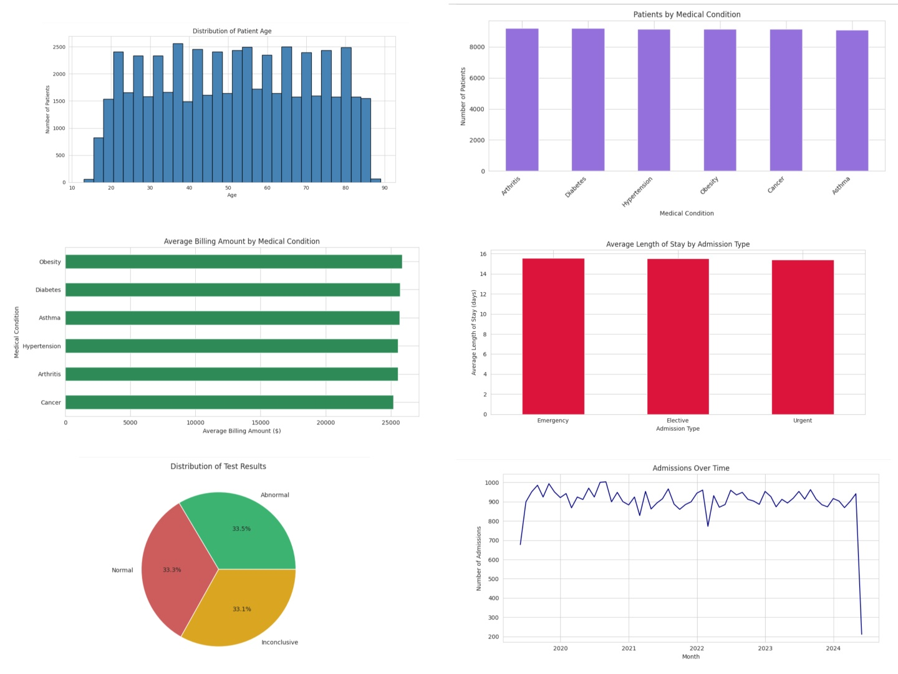

Markdown
# Healthcare Patient Data Analysis Using Python



## Project Overview
This project analyzes healthcare patient data using Python to identify patterns in patient demographics, medical conditions, billing, hospital stays, test results, and admissions over time.

## Objectives
This analysis answers six key questions:
1. What does the age distribution of patients look like?
2. Which medical conditions are most common?
3. How does average billing amount vary by medical condition?
4. Does admission type affect average length of stay?
5. What is the distribution of patient test results?
6. How do hospital admissions change over time?

## Dataset Information
* **Dataset Name:** Healthcare Patient Dataset
* **Source:** Kaggle / Healthcare Records
* **Note:** The raw `healthcare_dataset.csv` file is processed locally and excluded from public repository upload for performance and hygiene.

### Key Dataset Features Analyzed:
* `Age` — Patient age in years
* `Medical Condition` — Primary diagnosed condition
* `Billing Amount` — Total billing amount per visit
* `Admission Type` — Urgency category (*Elective*, *Urgent*, *Emergency*)
* `Length of Stay` — Hospital stay duration in days
* `Test Results` — Result status (*Normal*, *Abnormal*, *Inconclusive*)
* `Date of Admission` — Recorded date of hospital admission

## Tools & Technologies
* Python 3.9+
* Jupyter Notebook
* Pandas
* NumPy
* Matplotlib
* Seaborn

---

## Data Loading and Inspection

```python
import pandas as pd
import numpy as np
import matplotlib.pyplot as plt
import seaborn as sns

df = pd.read_csv("healthcare_dataset.csv")

df.head()
df.info()
df.describe()
df.isnull().sum()
df.duplicated().sum()
Explanation
These checks were used to understand the dataset structure, data types, missing values, duplicate records, and numerical summaries before analysis.

Data Cleaning and Preprocessing
Python
df["Date of Admission"] = pd.to_datetime(
    df["Date of Admission"],
    errors="coerce"
)

df.dtypes

missing_values = df.isnull().sum()
print(missing_values[missing_values > 0])

print("Duplicate records:", df.duplicated().sum())
Explanation
The data was inspected for missing values, duplicate records, data types, and fields requiring transformation.

Analysis 1: Patient Age Distribution
Question
What does the age distribution of patients look like?

Code
Python
plt.figure(figsize=(8, 5))

plt.hist(
    df["Age"],
    bins=20
)

plt.title("Distribution of Patient Age")
plt.xlabel("Age")
plt.ylabel("Number of Patients")

plt.show()
Explanation
A histogram was used to show how patients are distributed across different age groups.

Insight
The visualization helps identify the age ranges that occur most frequently in the dataset.

Analysis 2: Most Common Medical Conditions
Question
Which medical conditions are most common?

Code
Python
condition_counts = df["Medical Condition"].value_counts()

print(condition_counts)

condition_counts.plot(
    kind="bar",
    figsize=(8, 5)
)

plt.title("Most Common Medical Conditions")
plt.xlabel("Medical Condition")
plt.ylabel("Number of Patients")

plt.xticks(rotation=45)

plt.show()
Explanation
value_counts() counts the number of patients in each medical-condition category. A bar chart is then used to compare the categories.

Insight
The analysis identifies the medical conditions with the highest patient volumes.

Analysis 3: Average Billing by Medical Condition
Question
How does average billing amount vary by medical condition?

Code
Python
avg_billing = (
    df.groupby("Medical Condition")["Billing Amount"]
      .mean()
      .sort_values(ascending=False)
)

print(avg_billing)

avg_billing.plot(
    kind="barh",
    figsize=(8, 5)
)

plt.title("Average Billing Amount by Medical Condition")
plt.xlabel("Average Billing Amount")
plt.ylabel("Medical Condition")

plt.show()
Explanation
groupby() groups patients by medical condition, while mean() calculates the average billing amount for each condition.

Insight
The chart allows average billing amounts to be compared across medical conditions.

Analysis 4: Admission Type and Length of Stay
Question
Does admission type affect average length of stay?

Code
Python
avg_stay = (
    df.groupby("Admission Type")["Length of Stay"]
      .mean()
)

print(avg_stay)

avg_stay.plot(
    kind="bar",
    figsize=(8, 5)
)

plt.title("Average Length of Stay by Admission Type")
plt.xlabel("Admission Type")
plt.ylabel("Average Length of Stay")

plt.show()
Explanation
The data is grouped by admission type and the average length of stay is calculated for each category.

Insight
The visualization provides a comparison of hospital stay duration across admission types.

Analysis 5: Distribution of Test Results
Question
What is the distribution of patient test results?

Code
Python
test_results = df["Test Results"].value_counts()

print(test_results)

test_results.plot(
    kind="pie",
    autopct="%1.1f%%",
    figsize=(7, 7)
)

plt.title("Distribution of Test Results")
plt.ylabel("")

plt.show()
Explanation
value_counts() counts each test-result category, while the pie chart shows the percentage contribution of each category.

Insight
The chart shows the relative distribution of recorded patient test results.

Analysis 6: Hospital Admissions Over Time
Question
How do hospital admissions change over time?

Code
Python
df["Date of Admission"] = pd.to_datetime(
    df["Date of Admission"],
    errors="coerce"
)

admissions_over_time = (
    df.groupby(
        df["Date of Admission"].dt.to_period("M")
    )
    .size()
)

print(admissions_over_time)

admissions_over_time.plot(
    kind="line",
    figsize=(10, 5)
)

plt.title("Hospital Admissions Over Time")
plt.xlabel("Date")
plt.ylabel("Number of Admissions")

plt.show()
Explanation
The admission date is converted to datetime, grouped by month, and plotted as a line chart to show the admission trend.

Insight
The chart helps identify periods of relatively higher or lower hospital admission activity.

Overall Key Findings
Patient age distribution provides an overview of the demographic structure.

Medical-condition counts show which conditions have the highest patient volumes.

Average billing comparisons show differences in billing across medical conditions.

Length-of-stay analysis compares hospital stays across admission types.

Test-result analysis shows the distribution of recorded test outcomes.

Admission trends show changes in patient volume over time.

Recommendations
Monitor high-volume medical conditions for resource planning.

Investigate factors associated with higher billing amounts.

Review admission categories associated with longer hospital stays.

Monitor test-result patterns for further investigation.

Use admission trends to support staffing and resource allocation.

Limitations
The analysis is limited to variables available in the dataset.

Observed relationships do not automatically establish causation.

Billing patterns may be influenced by factors not included in the dataset.

The analysis is descriptive rather than predictive or clinical.

Skills Demonstrated
Python programming

Pandas

NumPy

Data cleaning

Data inspection

GroupBy and aggregation

Date/time analysis

Exploratory Data Analysis

Matplotlib

Seaborn

Data visualization

Insight generation

Technical documentation


Conclusion
This project demonstrates a complete Python data-analysis workflow using healthcare patient data, from data inspection and preprocessing through analysis, visualization, insights, and recommendations.

Future Analysis
Further work could examine relationships between age and medical conditions, billing and admission type, length of stay and other patient variables, test results and medical conditions, and more detailed admission trends.

References

Python documentation

Pandas documentation

NumPy documentation

Matplotlib documentation

Seaborn documentation
